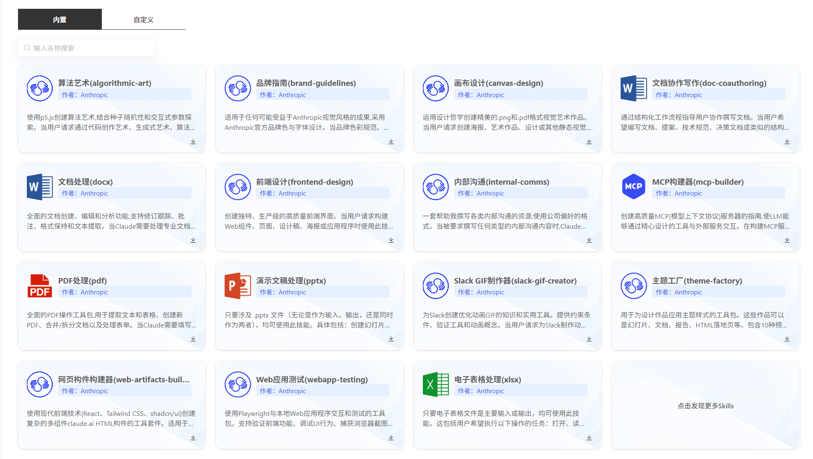
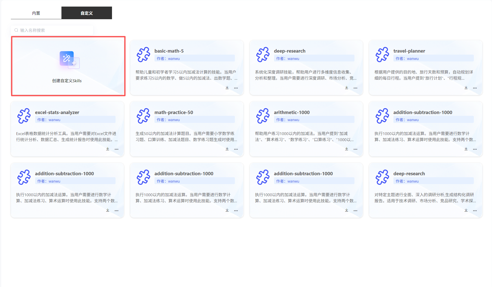
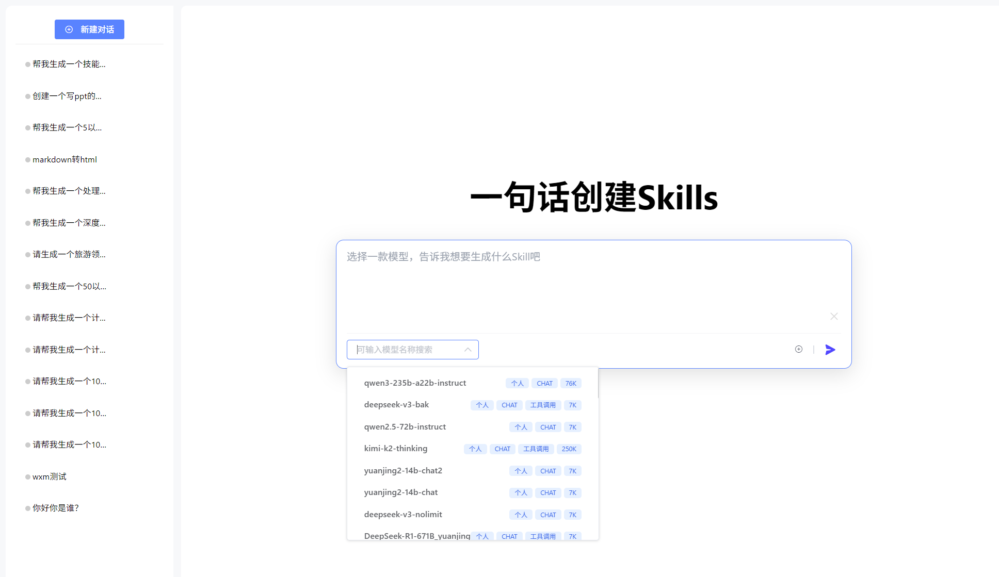
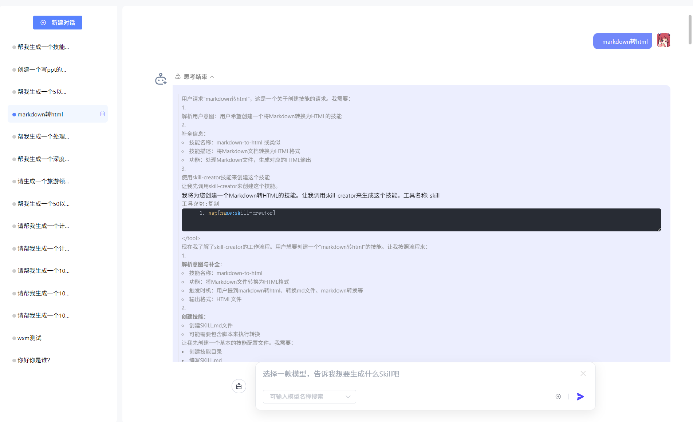
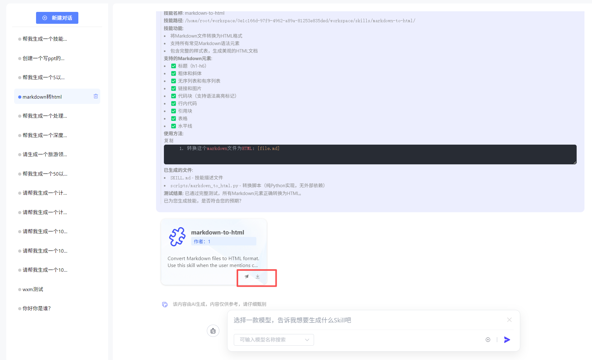
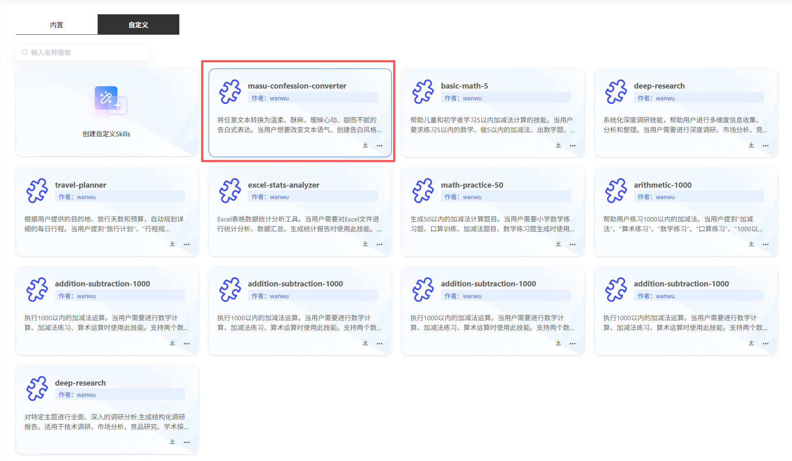
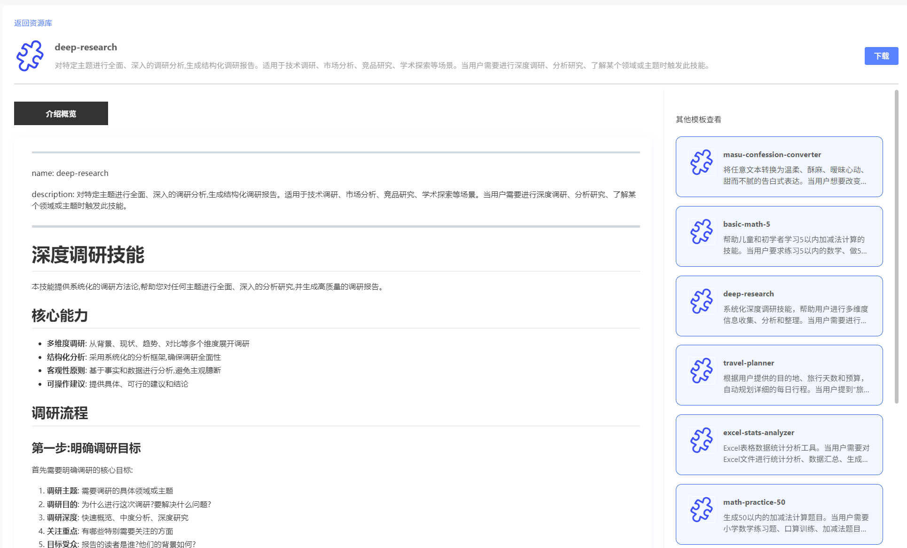

# Skills

### 内置Skills

支持用户查看Skills文件并下载，下载后可无缝对接OpenClaw，详细部署操作文档可查看[OpenClaw接入Skill教程](../8.通用智能体/机器人助手-OPENCLAW/OpenClaw接入Skill教程.md)。

 

### 自定义Skills

平台支持用户一句话创建skills，并发送至资源库，同时支撑下载。

#### 1）创建skills

点击“创建自定义skills”，用户可选择一款模型，通过自然语言对话，在平台中创建skill。同时可浏览创建历史。

#### 2）查看skills

点击卡片，可查看生成的skills，并支持下载。

