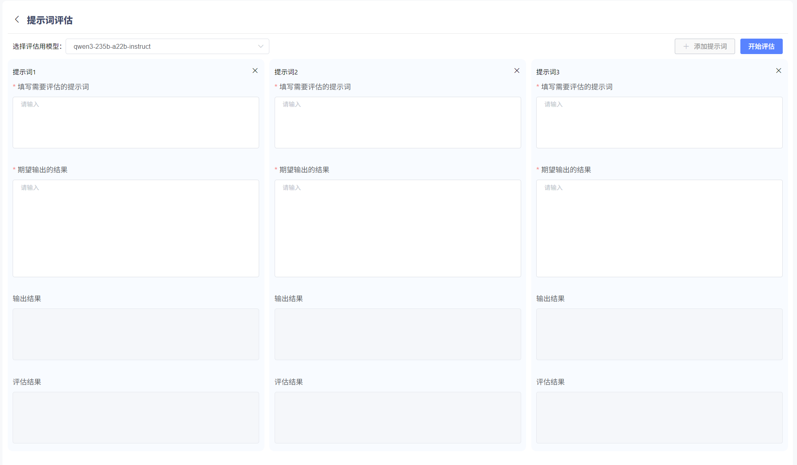
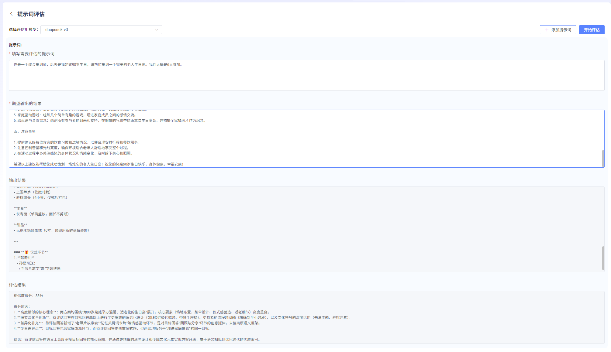

# 提示词

### 提示词创建及提示词优化

提供提示词模板配置界面，用户可新增提示词模板。或点击查看现有的提示词模板。平台在“模板广场”提供了丰富的提示词模板库，用户可进行复制使用。

针对已创建的提示词模板，还可进行提示词优化。优化后的提示词，可直接替换原有提示词。

### 提示词评估

用户通过提示词评估，可对自己输入的PROMPT的推理效果，根据用户提供的比照结果，进行在线效果评估。

需要用户提供： 1. 提示词 2. 比照结果 

提示词支持多组同时评估对比，最多可支持3组在线对比

**操作步骤：**

1. 在模型下拉列表选择此次提示词评估用的大模型。 
2. 提示词默认展示一组。如用户需要同事对比多组提示词，请点击“添加提示词”按钮，新增一列对比。 
3. 在提示词文本框输入提示词。
4. 在期望输出结果文本框，输入用户认为的标准答案，作为比照结果。
5. 点击开始评估，大模型会自动进行推理。推理完毕后会再度进行效果评估。

