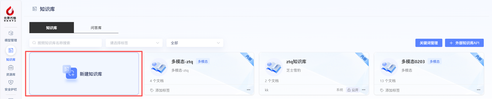
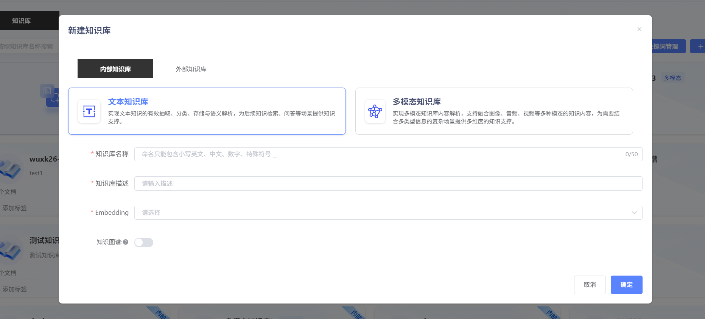
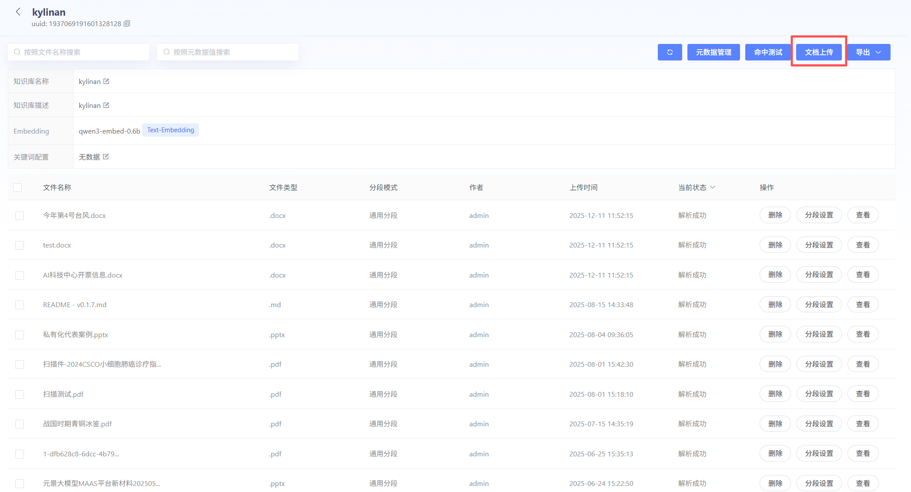

# 创建内部知识库

## 新建内部知识库

若用户要使用RAG功能，需要先创建知识库，关联Embedding模型。其中Embedding模型，需提前在模型管理模块上传。用户也可进行标签设置，方便进行知识库筛选分类。（已创建但未填写内容的标签，可通过Backspace键快捷删除）

平台支持两种类型的内部知识库创建：

- **文本知识库：**可以实现文本知识的有效抽取、分类、存储与语义解析，为后续知识检索、问答等场景提供知识支持。支持文件格式为pdf/docx/pptx/doc/wps/ofd/xlsx/xls/csv/txt/html/md
- **多模态知识库：**除了能上传文本类的文件以外，还支持上传图片、音频、视频进行解析。**需注意：**创建多模态知识库时，只能选择Multimodal Embedding模型

## 文件上传

平台支持用户上传本地文件或者从url上传。

**文本知识库：**

**多模态知识库**：

