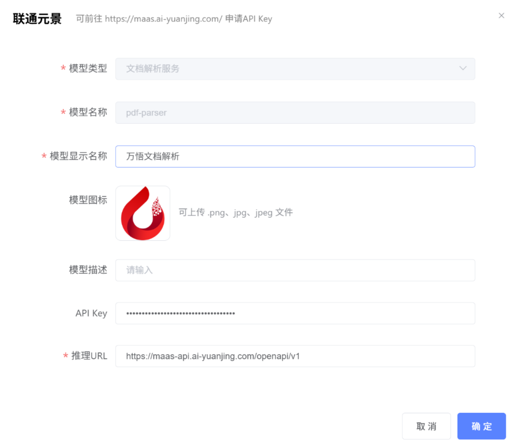
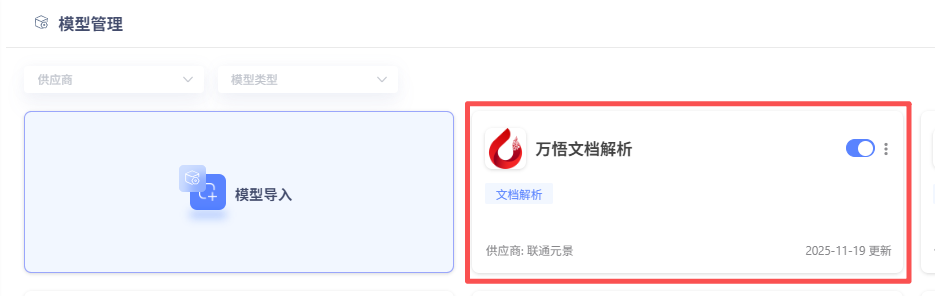
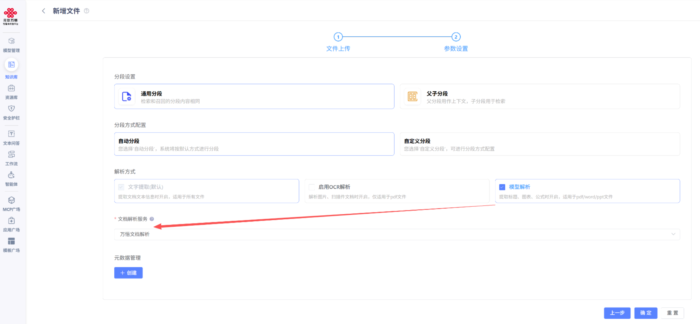
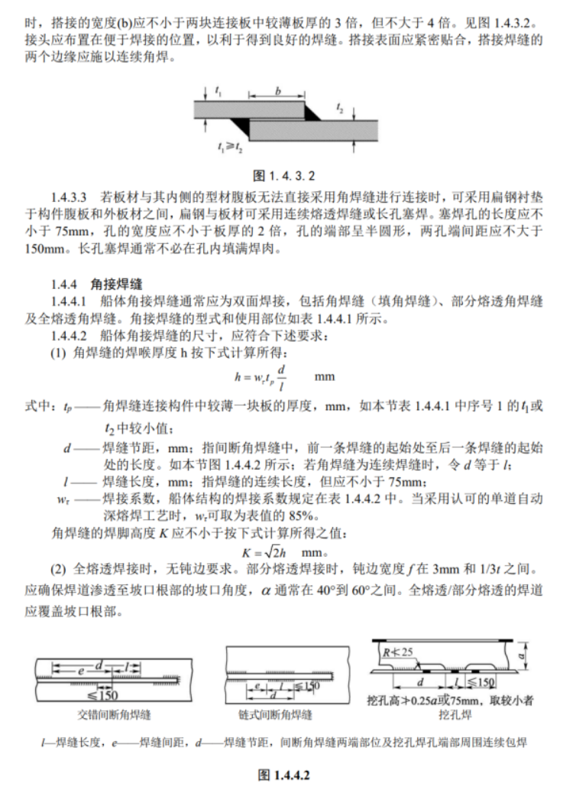
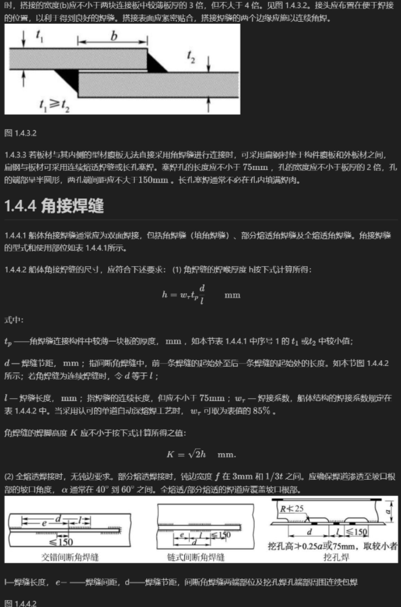
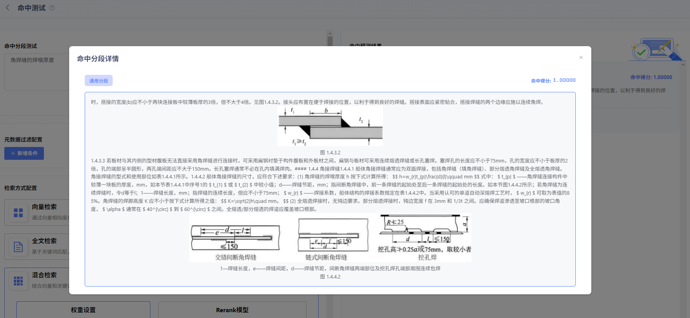
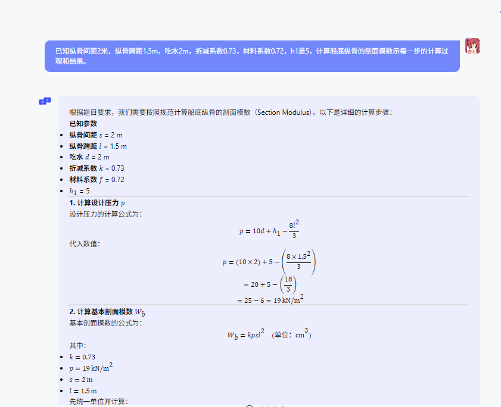

# 模型解析配置文档

接入文档解析服务，只需简单两步：

#### （1）导入服务：

在元景万悟平台的【模型管理】中，新建模型服务，选择“联通元景”供应商。可接入云端或本地服务，具体如下：

**【接入云端服务】**接入联通元景MaaS平台云端的文档解析服务，配置URL及API key等信息即可完成接入（可前往

https://maas.ai-yuanjing.com/ 申请API Key）。

**【接入本地服务】**接入本地部署的万悟文档解析服务，无需填写API Key，仅需将URL填写本地服务调用地址即可完成接入。万悟文档解析服务部署方式文档如下：https://github.com/UnicomAI/DocParserServer

部署完成后，按如下方式在模型管理中介入部署好的模型服务：

注：若接入的为本地服务，上图推理url取值为：http://ip:port/rag/model_parser_file，具体端口可以在部署文档中的docker run启动命令配置。

点击确定后，回到模型管理列表中可以看到刚才接入的：万悟文档解析服务，表示已经接入完成。

#### （2）开启使用：

在【知识库】中导入文件，解析方式选择【模型解析】，并选择已导入的万悟文档解析服务，即可享受强大的解析能力！

#### 效果有多惊艳？

升级后的元景万悟知识库，RAG智能解析与检索效果实现了质的飞跃！

（1）无论是文档的标题结构、复杂图表，还是令人头疼的数学公式，都能被精准解析和还原。

|                         PDF原始文档                          |                   解析后的Markdown还原效果                   |
| :----------------------------------------------------------: | :----------------------------------------------------------: |
|  |  |

**（2）多模知识的检索问答效果显著增强：**

智能检索：从文档找出计算某场景的公式，可以图文并茂生成答案

智能问答：给定问题找出对应公式并带入公式计算

元景万悟文档解析服务，让知识获取从未如此简单高效！立即访问我们的开源项目，体验国产算力带来的强大解析能力吧！

Github链接: https://github.com/UnicomAI/DocParserServer