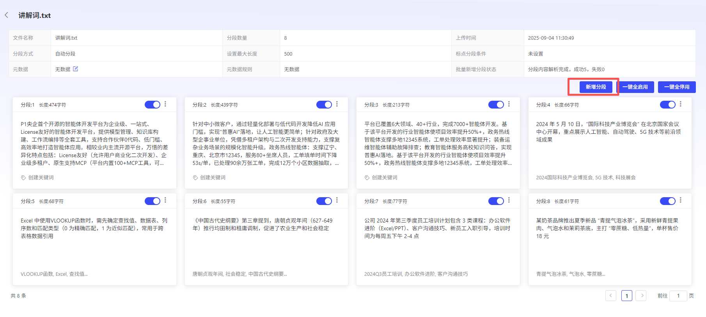
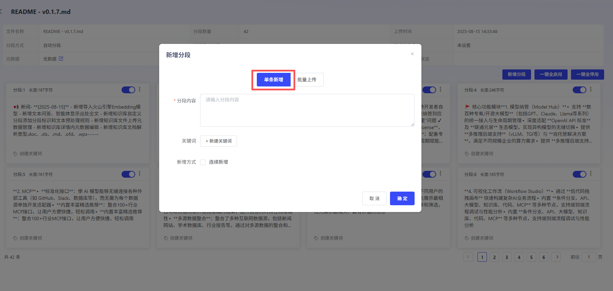
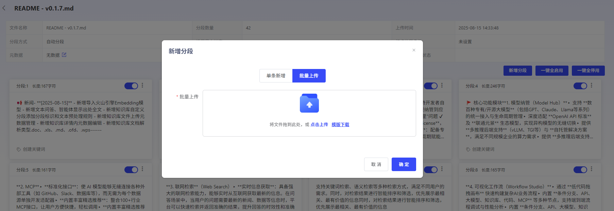
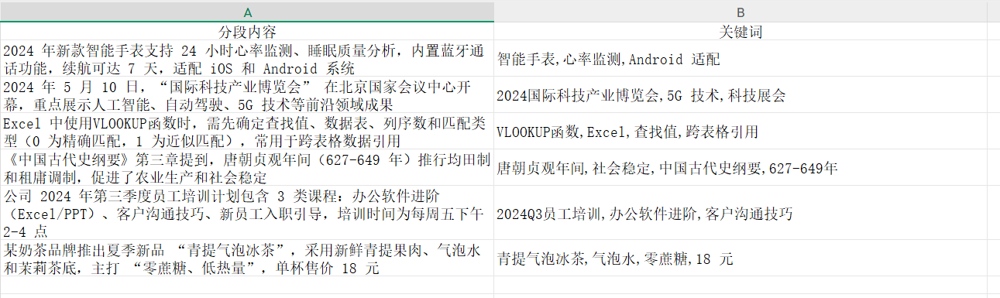
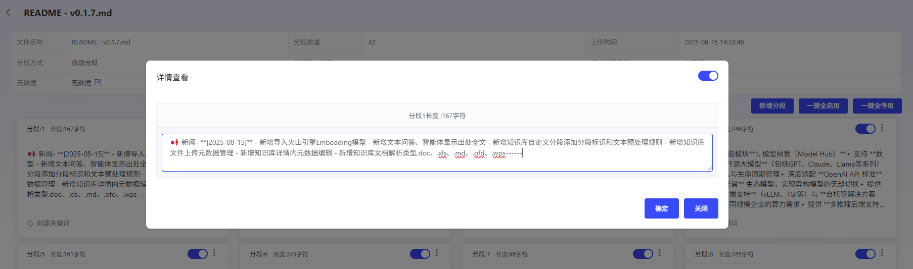
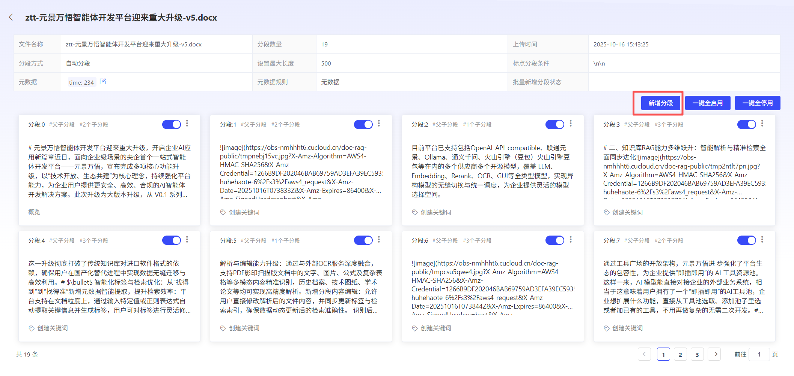
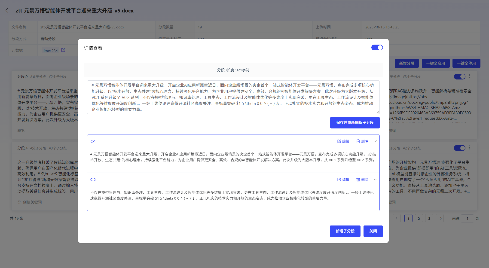
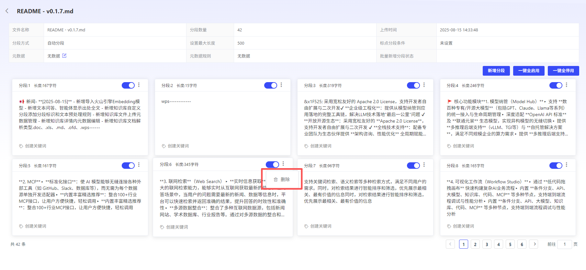

# 分段内容编辑

平台支持对分段内容进行新增、编辑、删除。

## 新增分段内容

- **单条新增：**平台支持用户新增不大于“分段最大长度”的分段内容。并支持新增多个关键词。并支持上传图片作为新增内容。
- **批量新增：**用户可下载批量新增模板，一次性上传多个分段和关键词。

## 分段内容编辑

平台支持用户对已有的分段内容进行二次编辑，但编辑后的分段内容长度，不能大于“分段最大长度”。

**【通用分段】**

**【父子分段】：**

**父分段编辑：**用户可编辑父分段内容，平台将自动重新解析子分段。

**子分段编辑：**用户可编辑或新增子分段内容，但不会同步更改父分段内容

## 分段内容删除

