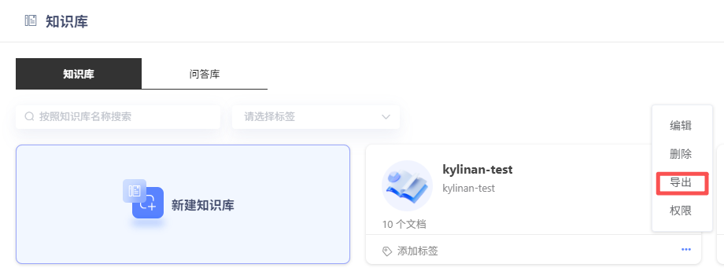
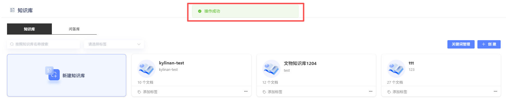
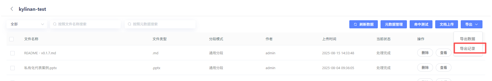
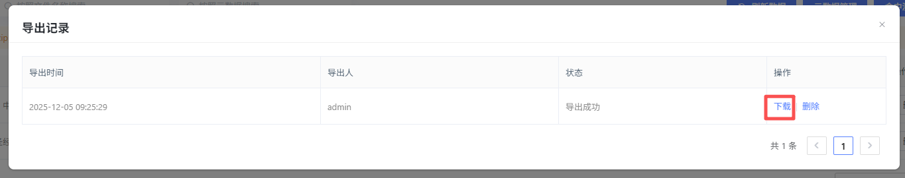
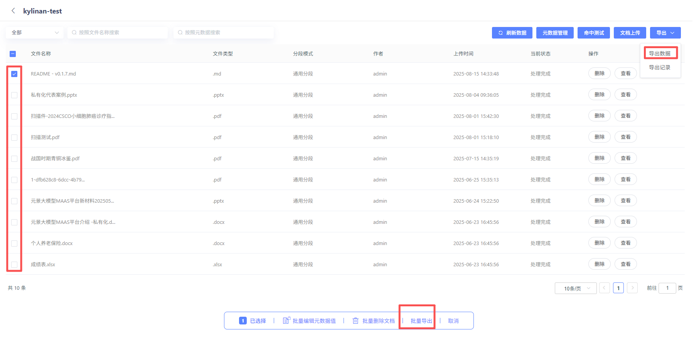
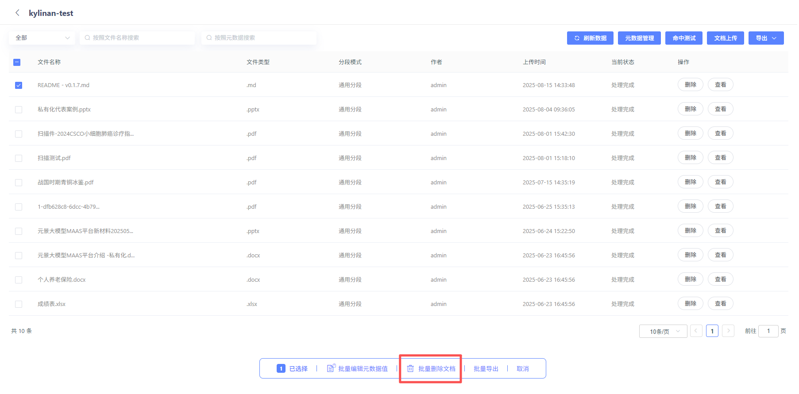

# 文档下载及删除

平台支持用户批量下载及删除知识库文件。

#### 1、下载整个知识库文件

点击知识库卡片中的【导出】按钮，可进行知识库导出操作。

点击进入知识库，选择【导出】-【导出记录】，点击【下载】

#### 2、单条或批量下载知识库文件

进入知识库，单选或多选知识库内的文件，点击屏幕下方的【批量导出】或屏幕右上方的【导出】-【导出数据】按钮，可对相应文件进行导出。

点击进入知识库，选择【导出】-【导出记录】，点击【下载】

#### 3、单条或批量删除知识库文件

进入知识库，单选或多选知识库内的文件，点击屏幕下方的【批量删除文档】，可对相应文件进行删除。支持跨页多选。

