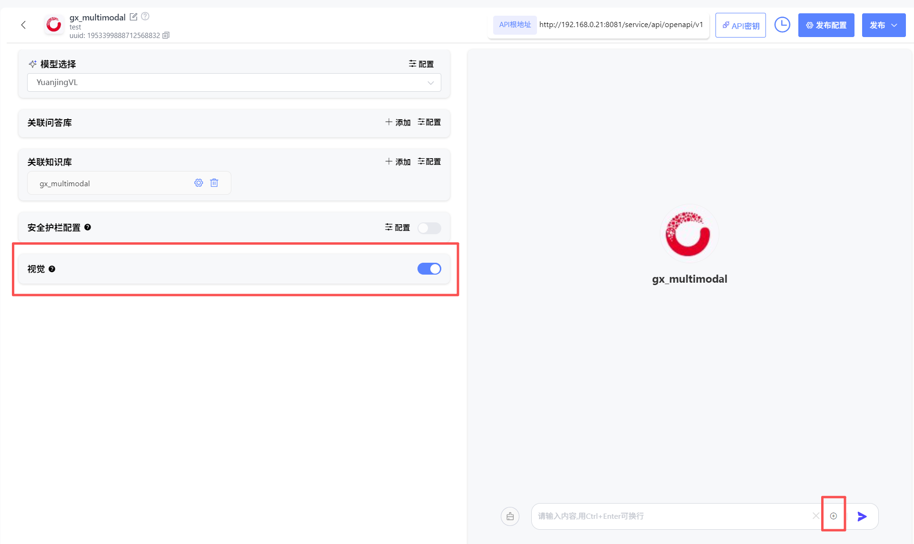

# 知识问答

### 1、知识问答创建

点击“创建知识问答”即可创建知识问答应用。用户可自行设定知识问答图标、名称、描述。

注：该应用**只会从知识库、问答库中进行检索**，若没有命中，则不会利用大模型进行兜底回答。以此控制问答范围。若需要用大模型进行兜底回答，可创建智能体应用，关联知识库，进行问答。若没有命中知识库内容，则会通过所选的大模型进行回答。

### 2、知识问答编辑

可通过选择大模型、知识库、问答库、配置检索方式，进行知识问答。

- #### 检索方式配置：

点击**“配置”**按钮，开启检索方式配置，目前支持3种检索方式配置，用户可根据知识库、问答库内文档的内容特点及使用场景，调整检索策略：

**1、向量检索：**通过向量相似度找到语义相近、表达多样的文本片段，适用于理解和召回语义相关信息。

**2、全文检索**：基于关键词匹配，能够高效查询包含指定词汇的文本片段，适用于精确查找。

**3、混合检索：**结合向量和关键词检索，融合语义理解与关键词匹配，兼顾相关性和准确性，提升检索效果。

- 混合检索-权重设置（默认）：权重设置功能用于调整不同检索方式的影响力。通过设置权重，可以控制语义相似度和关键词匹配在最终排序中的占比。
- 混合检索-rerank模型：重排序模型会根据候选文档与用户问题的语义匹配度，对初步检索结果进行重新排序从而进一步提升最终返回结果的相关性和准确性。

**4、知识图谱：**针对知识库（创建知识库时需开启知识图谱功能，且解析成功），可额外开启知识图谱功能。开启此功能后会调用大模型对切片内容提及的三元组并在知识库层面构建知识图谱。检索时会引入图谱增强chunk间关系检索，提升相关性召回效果。

注：问答库和知识库需分别进行检索方式配置。

- #### 元数据过滤-使用元数据筛选精准定位文档：

在知识问答中，**元数据过滤**功能，能让你像使用高级搜索一样，根据文档的“标签”（如 `category`、`status`、`author` 等）精确过滤，从而大幅提升检索结果的相关性和准确性。

**1、选择筛选模式**

首先，你需要从以下2种模式中选择一种来定义筛选规则。

- **禁用模式**
  *   **说明**：这是默认选项。选择此模式将完全关闭元数据筛选功能，节点会检索所有选中的知识库，不考虑任何元数据。
  
  *   **适用场景**：当你需要全面检索，或知识库文档没有统一的元数据标准时。
  
- **手动模式**

  *   **说明**：完全由你自定义筛选规则，自由组合多个条件，实现最精细的控制。
  *   **适用场景**：处理复杂的、多条件的、逻辑固定的筛选需求。这是最常用也最强大的模式。

**2、手动模式配置详解**

如果你选择了**手动模式**，请按照以下步骤进行配置：

**第1步：添加筛选条件**

1）在选择知识库后，点击**设置**按钮，打开元数据过滤按钮。

2）在配置框内，点击 **+新增条件**。

3）在弹出的下拉列表中，选择一个元数据字段。

*   **提示**：该列表会显示你当前选中的**知识库的所有**元数据字段。
*   如需添加更多字段，重复点击 **+新增条件** 即可。

**第2步：配置筛选规则**

选择字段后，你需要根据该字段的**数据类型**（字符串、数字、时间），来设定具体的筛选规则。

##### **A. 字符串类型**

适用于文本字段，如 `标签`、`分类`、`状态` 等。

| 筛选条件   | 说明与示例                                                   |
| :--------- | :----------------------------------------------------------- |
| **是**     | 完全匹配。例如 `is "Published"`，只返回状态**恰好是**“Published”的文档。 |
| **不是**   | 排除匹配。例如 `is not "Draft"`，返回所有状态**不是**“Draft”的文档。 |
| **为空**   | 字段为空。返回**未填写**该字段的文档。                       |
| **不为空** | 字段不为空。返回**已填写**该字段的文档。                     |
| **包含**   | 包含文本。例如 `contains "Report"`，会返回“Monthly Report”、“Annual Report”等。 |
| **不包含** | 不包含文本。例如 `not contains "Secret"`，会返回所有不含“Secret”的文档。 |
| **开始是** | 以...开头。例如 `starts with "Doc"`，会返回“Doc1”、“Document”等。 |
| **结束是** | 以...结尾。例如 `ends with "2024"`，会返回“Report 2024”、“Summary 2024”等。 |

> **⚠️ 大小写敏感提醒**：字符串匹配是**大小写敏感**的。`contains "App"` 会匹配 “Apple”，但**不会**匹配 “apple” 或 “APPLE”。

##### **B. 数字类型**

适用于数值字段，如 `阅读量`、`版本号`、`评分` 等。

| 筛选条件     | 说明与示例                                              |
| :----------- | :------------------------------------------------------ |
| **等于**     | 等于。例如 `= 100`，返回标记为100的文档。               |
| **不等于**   | 不等于。例如 `≠ 5`，返回所有标记不为5的文档。           |
| **大于**     | 大于。例如 `> 100`，返回标记大于100的文档。             |
| **小于**     | 小于。例如 `< 50`，返回标记小于50的文档。               |
| **大于等于** | 大于或等于。例如 `≥ 20`，返回标记大于或等于20的文档。   |
| **小于等于** | 小于或等于。例如 `≤ 200`，返回标记小于或等于200的文档。 |
| **为空**     | 字段为空。返回**未设置**该数字字段的文档。              |
| **不为空**   | 字段不为空。返回**已设置**该数字字段的文档。            |

##### **C. 时间类型**

适用于日期字段，如 `发布日期`、`最后修改时间` 等。

| 筛选条件   | 说明与示例                                                   |
| :--------- | :----------------------------------------------------------- |
| **是**     | 日期完全匹配。例如 `is "2024-01-01"`，只返回该日期的文档。   |
| **早于**   | 早于指定日期。例如 `before "2024-01-01"`，返回2024年1月1日之前的所有文档。 |
| **晚于**   | 晚于指定日期。例如 `after "2024-01-01"`，返回2024年1月1日之后的所有文档。 |
| **为空**   | 字段为空。返回**未设置**该时间字段的文档。                   |
| **不为空** | 字段不为空。返回**已设置**该时间字段的文档。                 |

**第3步：设置筛选值**

定义好规则后，你需要为规则提供一个具体的**筛选值**。

*   **字符串/数字**：直接输入即可，如 `Published`、`100`。
*   **时间**：系统会提供一个**时间选择器**，让你直观地选择日期，而无需手动输入格式。

**第4步：定义条件间的逻辑关系**

当你添加了**多条**筛选条件时，需要设定它们之间的关系。

*   **且逻辑**
    *   **含义**：文档**必须同时满足**所有条件，才会被检索到。
    *   **示例**：`category is "报告" 且 status is "已发布"`，只会检索出“分类为报告”**并且**“状态为已发布”的文档。
*   **或逻辑**
    *   **含义**：文档**只需满足其中任意一个**条件，就会被检索到。
    *   **示例**：`author is "张三" 或 author is "李四"`，会检索出所有作者是“张三”**或者**“李四”的文档。

- #### 视觉：

  用户进行以下选择搭配时，可开启视觉开关。打开视觉开关后，支持用户上传一张图片，对多模态知识库进行问答检索。

  **模型选择：**图文问答类LLM

  **关联知识库：**多模态知识库

  **检索方式配置：**多模态reran

### 3、知识问答调试

- **知识库**

  - 可给出回答对应的出处信息，进行信息追溯

  

- **问答库**

  - 可给出最多3个推荐问题

  

### 4、知识问答发布

- **发布**

编辑完毕的知识问答应用，点击“发布”可进行发布方式选择，用户可进行私密发布，也可进行公开发布。

**私密发布：**发布后仅对自己可见，可在“探索广场”-“私密发布的”查看。

**公开发布（全局可见）：**发布后可对全部用户进行共享，所有用户可在“探索广场”-“全部”查看。

**公开发布（组织内可见）：**发布后可对组织内用户进行共享，所有用户可在“探索广场”-“全部”查看。

- **发布配置**

**发布范围：**用户可对当前最新版本的工作流进行版本描述修改和发布范围变更。并可查看历史版本。

- **历史版本**

已发布的知识问答可查看历史版本，并随时将历史版本加载在当前草稿进行重新编辑并发布为新版本。

支持知识问答复制。

