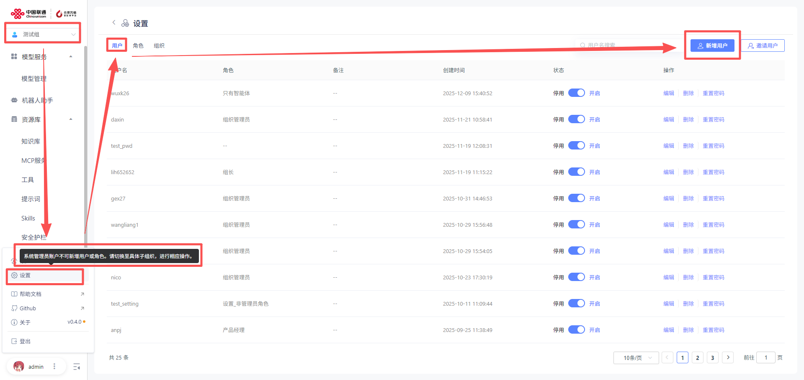
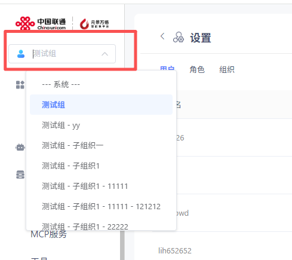

# 设置

### 1、个人信息

用户可在个人信息界面，修改登录密码。

### 2、组织管理

此模块可进行组织、用户、角色的统一管理。

**1）组织管理**

**组织查看**

管理员可对该组织内所有子组织情况进行查看，并可编辑、删除、停用和新增子组织。

点击“编辑”，即更改子组织名称。

**新增组织**

点击“新增组织”，可对组织名进行设置。点击“确认”，即可完成新增子组织。用户创建下级组织时，系统默认在新组织中创建一个例如"组织管理员"角色，默认拥有新组织的所有权限；同时该用户默认加入新组织，并对应该角色。

**2）角色管理**

**角色查看**

管理员可对该组织内所有角色情况进行查看，并可编辑、删除、停用和新增角色。其中“组织管理员”角色不可被删除和停用。同一个用户可以在多个组织中。

点击“编辑”，即更改角色名称以及菜单权限。

**新增角色**

**用户需切换至具体组织（--系统--下无法新增角色！）**点击“新增角色”，可对角色名和菜单权限进行设置。点击“确认”，即可完成新增角色。用户创建的新角色，权限集合不超过用户当前对应角色的权限集合。

**3）用户管理**

**用户查看**

组织管理员可对该组织内所有用户情况进行查看，并可编辑、删除、重置密码、新增账户和邀请用户。

系统管理员可对该系统内所有用户情况进行查看，并可编辑、删除、重置密码。**（注：系统管理员无法新增用户，只能查看用户！）**

点击“编辑”，即更改用户单位、电话、角色、邮箱。

**新增用户**

**用户需切换至具体组织（--系统--下无法新增用户！）**点击“新增用户”，可对用户名、密码、单位、电话、角色、邮箱进行设置。点击“确认”，即可完成新增用户。用户被分配到某个组织，可不对应任何角色。用户所在组织中，对应的角色有创建用户的权限，则该用户创建的新用户必须默认属于该组织。

**邀请用户**

  点击“邀请用户”，可对特定用户进行邀请。管理员可邀请该系统下任意不在该组织的用户，被邀请的用户自动加入该组织。

### 3、组织切换

平台支持多租户，用户可进行组织切换，查看不同组织下创建的应用，并进行编辑和使用。

### 4、平台配置

为方便用户二次开发，提供了可视化前端界面修改入口，支持用户修改标签页、登录页、平台配置。

