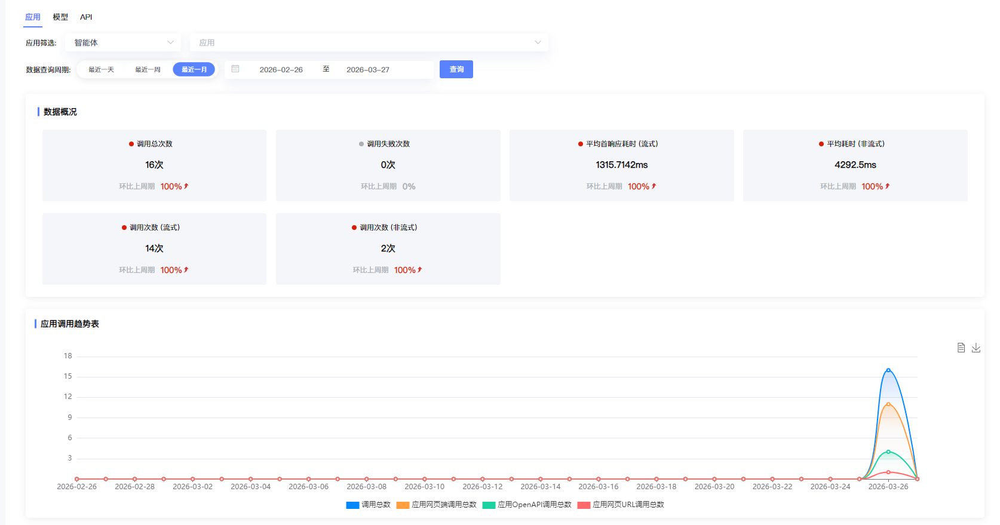
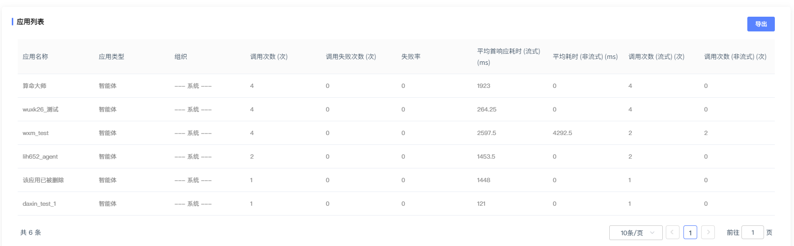
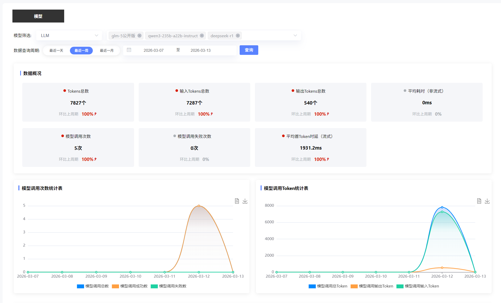
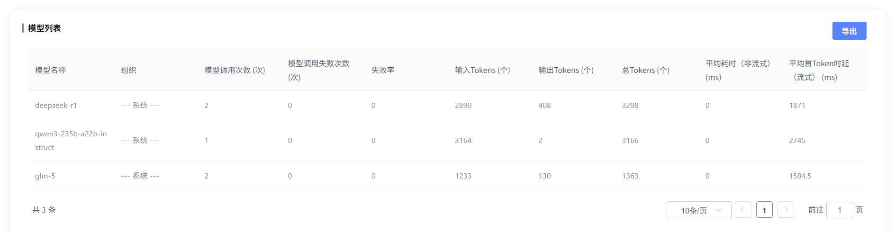
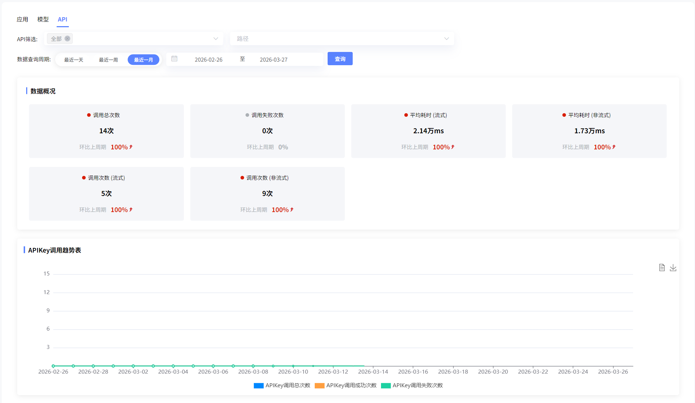
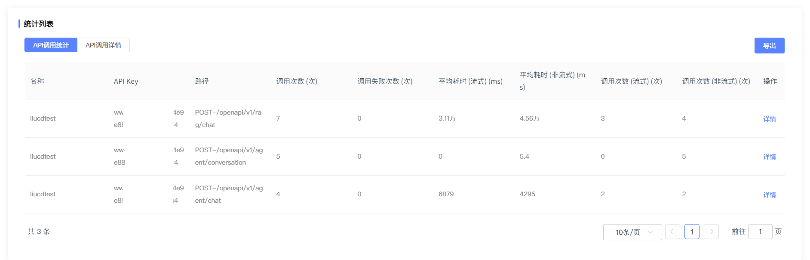

# 统计看板

## 应用

支持用户选择不同类型的应用（智能体、工作流、对话流、知识问答），查看模型调用总次数、平均响应耗时等参数，并支持导出下载。

## 模型

支持用户选择不同类型的模型，查看模型tokens总数、调用次数等参数，并支持导出下载。

## API

支持用户选择的API，查看API调用总次数、平均耗时等参数，并支持导出下载。点击详情也可查看API调用详情，如请求内容、响应内容等。

